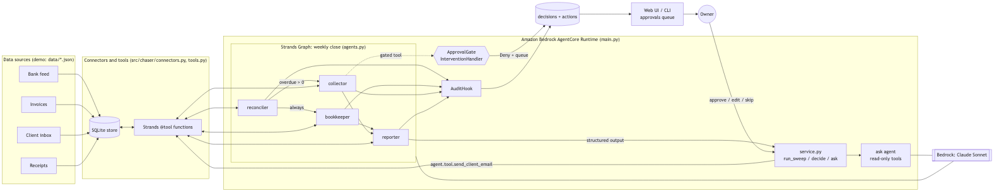

# Chaser

A weekly-close agent for freelancers: reconciles payments, chases overdue invoices, and asks you only before anything reaches a client.

**Live demo:** https://d344dcrnpg.us-east-1.awsapprunner.com (the web UI on AWS App Runner, calling the four-agent Graph on Amazon Bedrock AgentCore Runtime). Press "Run weekly close", wait about two minutes, and approve, edit or skip the proposals. It is a shared demo instance: everyone sees the same books, and its state resets to the demo dataset after 15 idle minutes.

## The problem

Freelancers and one-person businesses lose hours every week to back-office work: checking which invoices are still unpaid, matching bank deposits to invoices when the amounts differ by a processor fee or a partial payment, writing "just following up" emails with the right level of firmness, and hunting receipts for expenses before tax time.

Late payment is the norm rather than the exception for people who invoice directly; most freelancers have had invoices paid late, and the chasing itself takes hours a month. The tasks are repetitive but judgment-heavy: the right tone for a reminder depends on how late the invoice is, how that client has paid before, whether they already said "payment is coming", and what the contract says about late fees.

Chaser runs that weekly routine as a multi-agent pipeline, does the routine parts on its own, and turns the judgment calls into a short queue of proposals the owner approves, edits, or skips in one sitting.

## Who it's for

Freelancers, consultants, small studios and trades who invoice clients directly and do their own books.

## What the agent does

Every cycle (the "weekly close") four specialist agents run as a Strands Graph:

1. **Reconcile** (`reconciler`): match new bank deposits to open invoices: exact amount, amount minus a known fee pattern (2.9% + $0.30, flat wire fee), partial payments, one deposit covering two invoices. Mark invoices paid or partially paid. Unknown deposits are flagged as a low-severity review decision instead of guessed. Read recent client emails and record context ("says processing this week", "asked to resend to a new AP address").
2. **Books** (`bookkeeper`): categorize new expenses against the chart of accounts, attach receipts, and create a "Find receipt" to-do for expenses older than 7 days with no receipt. All routine; never gated.
3. **Collect** (`collector`, runs only if invoices are still overdue after reconciliation): for each overdue invoice pick a follow-up tier by age and history: gentle reminder (1-14 days), firm reminder with payment link (15-30), final notice citing the contract's late fee (31+), and for 60+ days recommend a call or write-off. It holds off when the client wrote about payment in the last week. It drafts the email with the client's name, invoice number, amount, due date and payment link. **Sending to a client, offering a payment plan, and proposing a write-off are gated**: they become pending decisions instead of executing.
4. **Report** (`reporter`): a structured `WeeklyCloseReport`: cash collected this week, outstanding by aging bucket (current / 1-30 / 31-60 / 61+), reconciliation results, drafts awaiting approval, books health, top three things the owner should know.

`ask` answers questions with read-only tools: "who still owes me money?", "what did I collect this month?".

**Walk-through on the demo data (today = 2026-09-12).** The reconciler matches Greenleaf's $920 check to INV-1044 exactly, matches Northwind's $2,120 wire to the $2,150 INV-1043 and books the $30 shortfall as a wire fee, records Harbor & Vine's $600 as a partial on the $1,200 INV-1041, and flags a $500 Zelle from "J. PARK" for review. The bookkeeper categorizes eleven expenses, attaches receipts, and creates one to-do for a $1,299 laptop with no receipt. The collector proposes: a tier-1 reminder to Bluefin (9 days), a tier-2 reminder to Acme (23 days, one prior reminder), a tier-3 final notice to Pixel Forge (41 days, 1.5%/month late fee per contract), and a resend of INV-1040 to Northwind's new AP address. It holds off on Orbital Labs (67 days) because their AP wrote on Tuesday that payment is processing, and notes that instead. The owner sees 4 approval cards and 1 review card; everything else already happened.

## Demo

Video: _link to be added_.

Three-minute local demo (needs Bedrock credentials, see "Run locally"):

```bash
make venv && cp .env.example .env
./scripts/demo.sh            # seed, run one weekly close, print status, start the UI on :8000
./scripts/demo.sh --dry-run  # just print the steps
```

Then in the browser: open an approval card, edit the email, **Approve with edits**; **Skip this week** on another; resolve the Zelle review card with **Match to invoice** or **Mark as other income**; ask "who still owes me money?".

## Architecture



*Numbered steps follow one cycle: trigger, routine work done silently, the one moment a human is needed, and how the answer gets back to the agent. Editable source: [docs/architecture.excalidraw](docs/architecture.excalidraw) (open at excalidraw.com); also [SVG](docs/architecture.svg).*

More detail in [docs/architecture.md](docs/architecture.md).

## How it uses Strands Agents

- **Graph multi-agent orchestration** (`GraphBuilder`, `Graph`, `GraphState`): `src/chaser/agents.py::build_graph`. Four `Agent` nodes, deterministic edges plus one conditional edge whose condition is a closure over the store (`has_overdue`), `set_entry_point`, `set_max_node_executions(8)`, `set_execution_timeout(600)`, `set_node_timeout(240)`, optional `set_session_manager`.
- **Custom `InterventionHandler`** (`strands.interventions`): `src/chaser/approval.py::ApprovalGate`. `before_tool_call` returns `Proceed()` for routine tools and `Deny(reason=...)` for gated ones after persisting the proposal as a decision. Attached to the collector via `Agent(interventions=[gate])`.
- **`HookProvider` / `AfterToolCallEvent`**: `src/chaser/hooks.py::AuditHook` writes every tool call to the `actions` table with the agent name; attached to every node and the ask agent.
- **`@tool` functions with precise docstrings**: `src/chaser/tools.py` (23 tools split into per-agent subsets `RECONCILER_TOOLS`, `COLLECTOR_TOOLS`, `BOOKKEEPER_TOOLS`, `REPORTER_TOOLS`, `ASK_TOOLS`).
- **Direct tool calls** (`agent.tool.<name>(**input)`): `src/chaser/service.py::decide` executes approved proposals on an agent rebuilt without the gate (`agents.py::make_execution_agent`, `record_direct_tool_call=False`).
- **Structured output** (`structured_output_model=WeeklyCloseReport`): `service.py::run_sweep` after the graph finishes; schema in `src/chaser/models.py`.
- **Session management**: `src/chaser/sessions.py::make_session_manager` returns `FileSessionManager` or `S3SessionManager` (when `SESSION_BUCKET` is set) for the conversational ask agent (`agents.py::make_ask_agent`).
- **`SlidingWindowConversationManager`** on every agent; `BedrockModel` (or `AnthropicModel`) via `src/chaser/model.py::make_model`.
- **System prompts as product logic**: `src/chaser/prompts.py` (role, step-by-step routine, handle-alone vs escalate, tone rules per tier).
- **Offline testing**: `tests/scripted_model.py` implements `strands.models.Model` with Bedrock-shaped stream events; each graph node gets its own scripted model through `agents.ModelFactory`.

## Human-in-the-loop design

Chaser uses **propose-then-execute**, not interrupt-and-resume.

When the collector calls a gated tool, `ApprovalGate.before_tool_call` stores the exact tool input as a pending decision (with a human summary such as "Send tier-2 reminder to Acme Robotics for INV-1042 ($2,400.00, 23 days overdue)") and returns `Deny` with the reason "Queued for owner approval as decision <id>. Do not retry this action; continue with other work and mention the pending approval in your summary." The model treats that as the tool result and moves on. A dedupe key `(tool_name, invoice_id)` prevents a retry, or next week's run, from creating a second card while one is pending.

When the owner approves, `service.decide` merges any edits (an edited body, a different address) into the stored input and executes the same tool directly through the owning agent. When the owner skips, the decision is marked denied and a client note "Owner declined on <date>" is stored; `get_client_profile` shows it, so the collector does not propose the same email next week.

Why this instead of interrupts: the weekly close is a background job. Blocking a graph mid-run on a human means holding agent state across hours or days and resuming a pipeline whose inputs may have changed. Denying and queuing means every sweep finishes, the owner reviews one batch of proposals when convenient, and the executed action is exactly what was proposed plus their edits. The trade-off is one extra step of latency for gated actions, which is the point.

## Run locally

Prerequisites: Python 3.12, [uv](https://docs.astral.sh/uv/), AWS credentials for an account with Anthropic Claude enabled in the Bedrock console (us-east-1), for example `aws login` or `aws configure` or an SSO profile.

```bash
git clone <this repo> && cd chaser
make venv                      # uv venv -p 3.12 .venv && uv pip install -e ".[dev]"
cp .env.example .env           # BEDROCK_MODEL_ID, AWS_REGION, DEMO_TODAY, ...
make seed                      # load data/ into .data/chaser.db
make sweep                     # one weekly close from the CLI (calls Bedrock)
.venv/bin/python -m chaser.cli status
.venv/bin/python -m chaser.cli decisions
.venv/bin/python -m chaser.cli decide <decision-id> yes
.venv/bin/python -m chaser.cli ask "who still owes me money?"
make serve                     # uvicorn app.server:app --reload --port 8000
```

Environment variables (all optional, see `.env.example`): `BEDROCK_MODEL_ID` (default `global.anthropic.claude-sonnet-4-6`), `AWS_REGION`, `DEMO_TODAY` (default `2026-09-12`), `CHASER_DB_PATH`, `SESSION_BUCKET`, `AGENT_BACKEND` (`local` | `agentcore`), `AGENT_RUNTIME_ARN`, `SWEEP_INTERVAL_SECONDS` (default 900, `0` disables the scheduler), `SWEEP_ON_START`. `MODEL_PROVIDER=anthropic` with `ANTHROPIC_API_KEY` uses the Anthropic API directly instead of Bedrock.

While the weekly close runs (about two minutes for the four-node graph), the inbox shows a live strip: a timer, which node is working, and that node's own narration as it happens (what it said, which tool it is calling, each result), written by a `ProgressHook` on Strands' `MessageAddedEvent`. With `AGENT_BACKEND=agentcore` the web app also pings the runtime every `KEEPALIVE_SECONDS` (default 600, `0` disables) so the shared session and its state survive AgentCore's 15-minute idle timeout and visitors never pay a cold start.

Tests and lint run offline with a scripted model, no AWS needed:

```bash
make test    # pytest, 43 tests
make lint    # ruff check .
```

Web API: `GET /api/state`, `POST /api/sweep`, `POST /api/decisions/{id}` `{"response": "yes"|"no", "edits": {}}`, `POST /api/ask` `{"prompt"}`, `GET /api/health`, `POST /api/seed`.

## Deploy to Amazon Bedrock AgentCore

```bash
npm i -g @aws/agentcore
# edit agentcore/aws-targets.json: replace <ACCOUNT_ID> with your account id (region us-east-1)
./scripts/deploy_agentcore.sh          # agentcore validate && agentcore deploy -y, from the repo root
agentcore invoke '{"action": "status"}'
agentcore invoke '{"action": "ask", "question": "Who still owes me money?"}'
agentcore invoke '{"action": "sweep"}'
```

`agentcore/agentcore.json` defines a CodeZip runtime `ChaserAgent` (Python 3.12, `main.py`, CDK-managed; the generated CDK app lives in `agentcore/cdk`). The CLI wraps whatever you pass to `invoke` as `{"prompt": "..."}`; `main.py` unwraps a JSON object from that field, and treats any other text as an `ask`. `Dockerfile` is the ARM64 container alternative. The runtime filesystem is read-only except `/tmp`, so `CHASER_DB_PATH` and `CHASER_SESSIONS_DIR` point there and the entrypoint seeds the demo data on first use; point them (or a store implementation) at durable storage for real use.

Deployed for the hackathon as `arn:aws:bedrock-agentcore:us-east-1:796330847946:runtime/Chaser_ChaserAgent-20whYPEX0A` (stack `AgentCore-Chaser-default`).

Point the web UI at the deployed runtime:

```bash
AGENT_BACKEND=agentcore AGENT_RUNTIME_ARN=arn:aws:bedrock-agentcore:us-east-1:<ACCOUNT_ID>:runtime/ChaserAgent-xxxx make serve
```

### Host the web UI (the live demo URL)

```bash
make deploy-web    # scripts/deploy_web.sh
```

`infra/web.yaml` is one CloudFormation stack: an ECR repository, a CodeBuild project that clones this repo from GitHub and builds the `Dockerfile` (so no local Docker is needed), and an AWS App Runner service that runs `uvicorn app.server:app` with `AGENT_BACKEND=agentcore`. The App Runner instance role is allowed exactly one action, `bedrock-agentcore:InvokeAgentRuntime` on this runtime; no AWS keys are stored anywhere. The service uses a fixed `AGENTCORE_SESSION_ID`, so every visitor shares one runtime session, and `SWEEP_INTERVAL_SECONDS=0` so only visitors start sweeps. Re-run `make deploy-web` after pushing to rebuild; App Runner auto-deploys the new image.

Live: https://d344dcrnpg.us-east-1.awsapprunner.com (stack `chaser-web`).

## Project structure

```
main.py                    AgentCore entrypoint: sweep | decide | ask | status | seed | state
app/server.py              FastAPI UI + API, background scheduler, sweep lock
app/static/                index.html, app.js, styles.css (approvals queue, aging, report, books, activity feed)
src/chaser/
  agents.py                node agents, TOOL_OWNERS registry, build_graph, make_execution_agent, make_ask_agent
  approval.py              ApprovalGate InterventionHandler, proposal summaries, dedupe
  hooks.py                 AuditHook (AfterToolCallEvent -> actions table)
  tools.py                 all @tool functions, grouped per agent
  prompts.py               system prompts and the sweep task
  service.py               run_sweep, decide, ask, status, seed, ui_state
  store.py                 SQLite store (clients, invoices, transactions, decisions, actions, reports, outbox)
  matching.py              pure deposit/receipt matching (exact, fee, partial, combined)
  tiers.py                 follow-up tier selection
  models.py                WeeklyCloseReport (Pydantic)
  connectors.py            connector protocols + JSON demo connectors + outbox email sender
  backend.py               Backend protocol: LocalBackend, AgentCoreBackend (invoke_agent_runtime)
  sessions.py  model.py    session manager and model factories
  config.py  context.py    demo clock, logging, per-process store/cycle context
  cli.py  seed.py          CLI over the service functions
data/                      clients, invoices, bank_transactions, receipts, inbox (JSON), chart_of_accounts.yaml
docs/                      architecture.png/.svg/.excalidraw/.md, submission.md, demo-script.md, decisions.md
agentcore/                 agentcore.json, aws-targets.json
scripts/                   demo.sh, deploy_agentcore.sh
tests/                     scripted_model.py + 43 tests
```

## Data and connectors

Everything under `data/` is synthetic demo data for a fictional studio: 7 clients, 14 invoices, 30 days of bank transactions, receipts and 12 inbox emails, dated relative to `DEMO_TODAY=2026-09-12`. `connectors.py` defines protocols (`BankConnector`, `InvoiceSource`, `MailboxConnector`, `ReceiptSource`, `EmailSender`); the demo implementations read those JSON files and write outgoing email to an `outbox` table instead of sending. No real bank, mailbox or accounting system is connected. The SQLite store is the demo persistence layer and its API is deliberately small so a DynamoDB implementation can replace it.

## Roadmap

- Real connectors: bank CSV / Plaid, Gmail or IMAP for the inbox, Stripe payment links, QuickBooks or Wave export.
- SES for sending; DynamoDB store; EventBridge schedule instead of the in-process timer.
- Learn tone preferences from the owner's edits; per-client reminder cadence.
- Multi-currency and tax-time export.

## License

Apache-2.0. Copyright 2026 Ritwika Kancharla. See [LICENSE](LICENSE).
